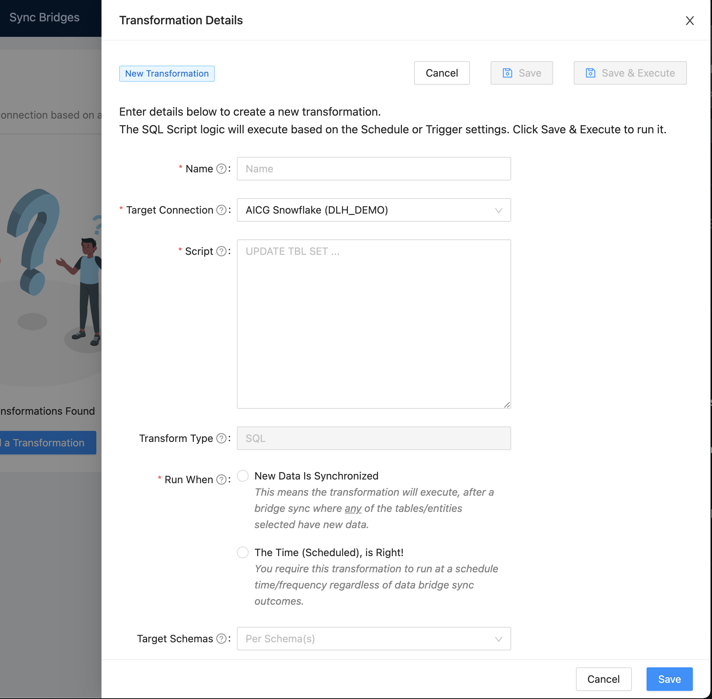

# Transformations

## Add a Transformation
1. Click on **Transformation** from the header menu
1. Click on **New Transformation** or **Add a Transformation** to show the Transformation creation form.

    

1. In the Transformation creation form enter all required fields and click the **Save** button when ready to finish or test the transformation.

    

