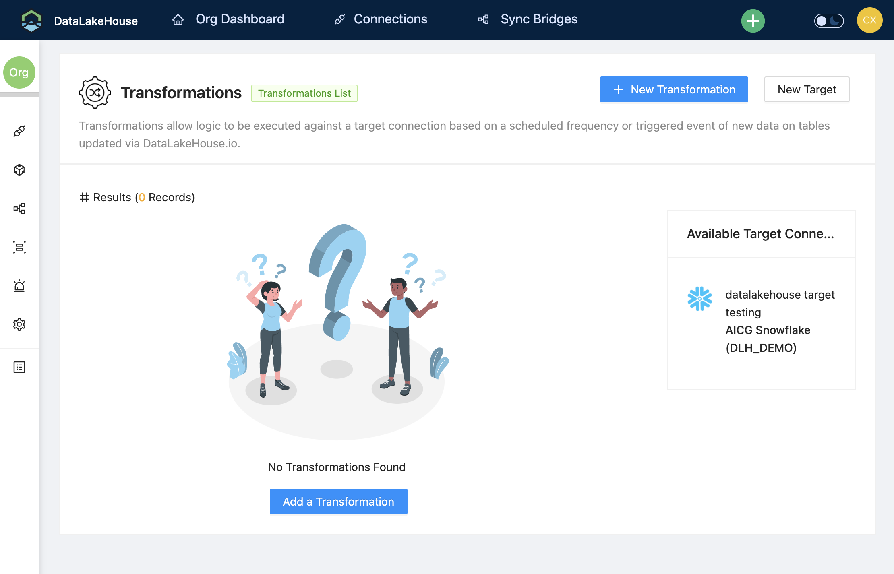

# SQL Transformations

Transformations allow logic to be executed against a target connection based on a scheduled frequency or triggered event of new data on tables updated via DataLakeHouse.io.

## Add a Transformation

1. Click on **Transformation** from the header menu
2. Click on **New Transformation** or **Add a Transformation** to show the Transformation creation form.

    

3. Update the form and determine what options to select.